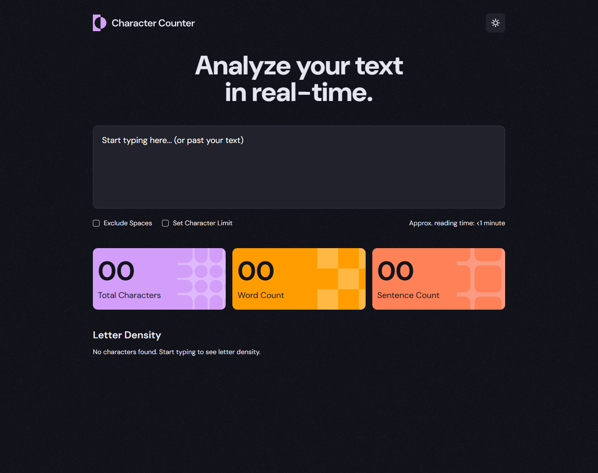

# Frontend Mentor - Character counter solution

This is a solution to the [Character counter challenge on Frontend Mentor](https://www.frontendmentor.io/challenges/character-counter-znSgeWs_i6). Frontend Mentor challenges help you improve your coding skills by building realistic projects.

## Table of contents

- [Frontend Mentor - Character counter solution](#frontend-mentor---character-counter-solution)
  - [Table of contents](#table-of-contents)
  - [Overview](#overview)
    - [The challenge](#the-challenge)
    - [Screenshot](#screenshot)
    - [Links](#links)
  - [My process](#my-process)
    - [Built with](#built-with)
    - [What I learned](#what-i-learned)
    - [Useful resources](#useful-resources)

## Overview

### The challenge

Users should be able to:

- Analyze the character, word, and sentence counts for their text
- Exclude/Include spaces in their character count
- Set a character limit
- Receive a warning message if their text exceeds their character limit
- See the approximate reading time of their text
- Analyze the letter density of their text
- Select their color theme
- View the optimal layout for the interface depending on their device's screen size
- See hover and focus states for all interactive elements on the page

### Screenshot

### Links

- Live Site URL: https://clinquant-smakager-ca6d7f.netlify.app/

## My process

### Built with

- Semantic HTML5 markup
- CSS custom properties (token architecture)
- Flexbox and CSS Grid
- Mobile-first workflow
- [CUBE CSS](https://cube.fyi/) methodology
- [Svelte 5](https://svelte.dev/) - reactive framework
- [Vite](https://vitejs.dev/) - build tool
- [Intl.Segmenter API](https://developer.mozilla.org/en-US/docs/Web/JavaScript/Reference/Global_Objects/Intl/Segmenter) - text segmentation
- [View Transitions API](https://developer.mozilla.org/en-US/docs/Web/API/View_Transitions_API) - theme switch animation

### What I learned

**Starting with semantic HTML and CSS first** — I began with HTML structure and CSS layout using CUBE CSS principles, focusing on tokens and spacing before adding any JavaScript logic.

**The Intl.Segmenter API** — This was a game-changer for accurate text segmentation (graphemes, words, sentences) compared to generic `split()` and `slice()` methods. It handles multi-codepoint characters and different languages correctly.

**Complexity led to Svelte** — I initially wrote vanilla JavaScript, but as state and logic grew (multiple counters, validation, theme state), managing DOM updates and state became tedious, especially with bar renderings. Moving to Svelte v5 made reactive updates and component communication much cleaner.

**Svelte v5 features** — First time using the latest version after using v3 years ago. The data binding for input controls (`bind:value`) and reactive variables (`$derived`) made managing form state and derived statistics feel natural and concise.

**Advanced CSS for theming** — Used `color-scheme` CSS property combined with `light-dark()` to create dynamic token variables, then layered a checkbox-based toggle to override the user's OS preference. Added View Transitions API to smoothly animate the theme switch.

### Useful resources

- [MDN: Intl.Segmenter](https://developer.mozilla.org/en-US/docs/Web/JavaScript/Reference/Global_Objects/Intl/Segmenter) — Proper text segmentation for graphemes, words, and sentences across different languages and character sets.
- [MDN: View Transitions API](https://developer.mozilla.org/en-US/docs/Web/API/View_Transitions_API) — Smooth animations between DOM state changes, perfect for theme switching.
- [Svelte 5 Documentation](https://svelte.dev/) — Reactive variables and derived state management made complex UI logic straightforward.
- [CUBE CSS by Andy Bell](https://cube.fyi/) — Token-driven, scalable CSS methodology that scales from small components to entire design systems.
